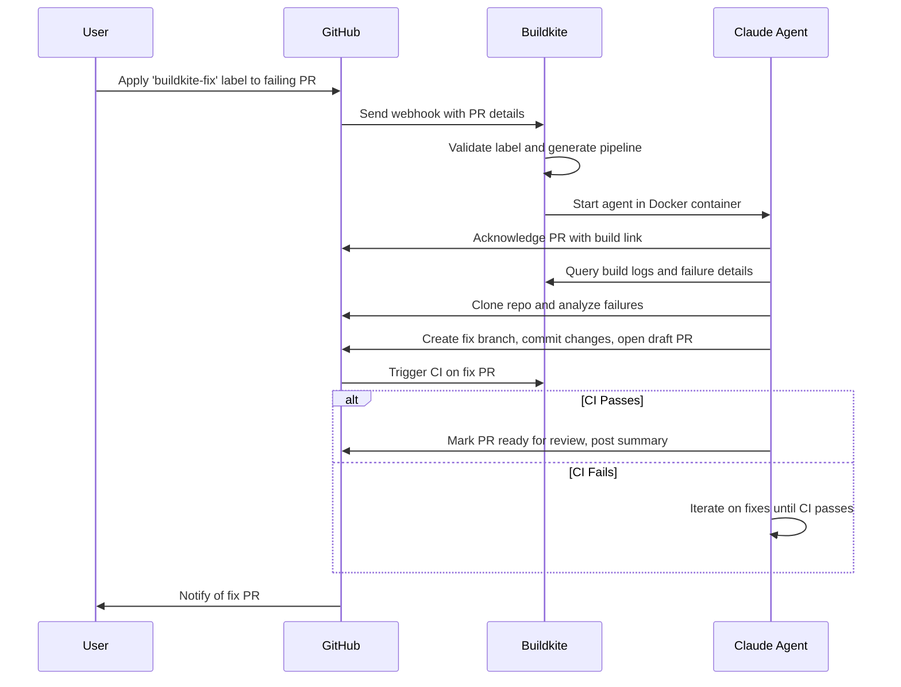

# Buildkite Agentic Pipeline Example: PR Build Fixer

A [Buildkite](https://buildkite.com) pipeline that uses [Claude Code](https://docs.claude.com/en/docs/claude-code/overview) and Buildkite model providers to diagnose and fix broken PR builds.

## Setting up

### Step 1: Start with an existing GitHub repository

Make sure you have access to a GitHub repository with a Buildkite pipeline. You'll create a failing pull request on this repository to test the fix bot.

### Step 2: Prepare your agentic pipeline

1. [Create a new GitHub repository](https://github.com/new?template_name=buildkite-agentic-pr-fix-example&template_owner=cnunciato) using this repository as a template.
1. [Create a new Buildkite pipeline](https://buildkite.com/organizations/~/pipelines/new) for your newly templated repository with a Linux [hosted agents](https://buildkite.com/docs/pipelines/hosted-agents) cluster.
1. [Create a new pipeline trigger](https://buildkite.com/~/buildkite-agentic-pr-fix-example/settings/triggers/new?trigger_type=webhook) for the pipeline, then copy the generated webhook URL to your clipboard.
1. On the **Settings** > **Webhooks** page of the GitHub repository from Step 1, add a new webhook, paste your Buildkite webhook URL into the **Payload URL** field, choose **Select individual events**, choose **Pull requests**, and save.
1. Create two new [Buildkite secrets](https://buildkite.com/docs/pipelines/security/secrets/buildkite-secrets) with the following names:
   1. `GITHUB_TOKEN`: A GitHub [personal access token](https://docs.github.com/en/authentication/keeping-your-account-and-data-secure/managing-your-personal-access-tokens) with `repo` and `pull_request` read/write scopes.
   1. `API_TOKEN_BUILDKITE`: A Buildkite [API access token](https://buildkite.com/docs/apis/managing-api-tokens) with `read_builds`, `read_build_logs`, and `read_pipelines` permissions.

### Step 3: Trigger the pipeline

1. Create a new failing pull request on the GitHub repository from Step 1 that causes the Buildkite build to fail. Apply the `buildkite-fix` label to it. (This label is configurable in `.buildkite/pipeline.yml`.)
1. In a few moments, you should see a new comment appear on the PR confirming the agent's picked up the task. Follow the link to the Buildkite dashboard to have a look.
1. Once the agent determines a fix, you should see a new PR submitted explaining what was done. Have a look at that PR, and if it looks good, approve and merge.

That's it! Your issue should now be fixed. :tada:

## Handling multiple repositories

A single agentic pipeline can handle builds originating from multiple GitHub repositories. Just create a new pipeline trigger and associated GitHub webhook for each one (as described in Step 2 above), and apply the `buildkite-fix` label as needed.

## How it works

The pipeline listens for webhooks originating from GitHub pull-request events. When a labeled PR is detected, the pipeline runs the `handler` script, which adds a step to the running pipeline that uses Claude to diagnose and fix the failure, [annotating](https://buildkite.com/docs/apis/rest-api/annotations) the Buildkite build as it goes. When the fix is complete, Claude commits the changes to a new feature branch, submits a new PR, and reports back on the original PR with a summary.

The following diagram shows the high-level flow, beginning with the PR label:

### Step summary

1. User applies a `buildkite-fix` label to a failing GitHub PR.
1. GitHub sends a webhook notification to Buildkite with PR details, triggering the pipeline.
1. Pipeline evaluates the webhook payload and conditionally adds a step to the running pipeline to launch Claude.
1. In a Docker container, Claude queries the build logs, analyzes the failures, and creates a fix on a new branch.
1. Claude submits a new PR with the fix and posts a summary back to the original PR.
